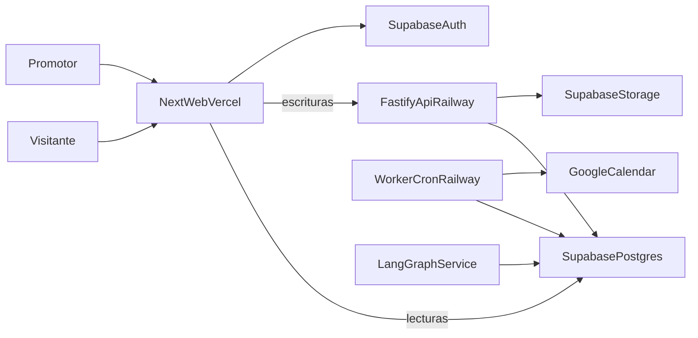

# Plan de Agenda Comunitaria

## Producto y decisiones cerradas
- Problema: dar a promotores, artistas y organizadores una agenda pública propia que también pueda curar eventos reutilizables de otras agendas sin perder autoría.
- Usuarios: visitantes anónimos, usuarios registrados (todos nacen como promotores) y, más adelante, promotores pagos con asistente AI.
- Idioma inicial: español; zona predeterminada `America/Argentina/Buenos_Aires`, guardando siempre zona IANA por evento.
- Acceso: lectura pública sin cuenta; registro con magic link y Google mediante Supabase Auth.
- El proyecto previo [`agent-ui`](/Users/gabimarin/www/Agent%20Calendar/agent-ui) no contiene plugin de calendario ni historial Git reutilizable. Se parte de cero en [`agenda-comunidad`](/Users/gabimarin/www/Agent%20Calendar/agenda-comunidad).
- El alcance se libera en etapas: Fase 1A es lanzable por sí sola; la sincronización con Google es clave pero no bloquea el lanzamiento.

## Arquitectura
- Monorepo TypeScript con `pnpm`:
  - [`apps/web`](/Users/gabimarin/www/Agent%20Calendar/agenda-comunidad/apps/web): Next.js App Router en Vercel. Las lecturas públicas se resuelven en Server Components contra Postgres con RLS y caché/ISR, sin salto intermedio.
  - [`apps/api`](/Users/gabimarin/www/Agent%20Calendar/agenda-comunidad/apps/api): Fastify en Railway para escrituras, reglas de negocio, integraciones y webhooks; validación Zod, verificación de JWT de Supabase y endpoint `/health`.
  - [`apps/worker`](/Users/gabimarin/www/Agent%20Calendar/agenda-comunidad/apps/worker): proceso y cron en Railway para sincronización con Google, mantenimiento de ocurrencias, importaciones y luego recordatorios.
  - [`packages/domain`](/Users/gabimarin/www/Agent%20Calendar/agenda-comunidad/packages/domain): schemas, tipos, permisos y contrato de búsqueda compartidos.
  - [`supabase/migrations`](/Users/gabimarin/www/Agent%20Calendar/agenda-comunidad/supabase/migrations): esquema, funciones, vistas, índices y RLS versionados.
  - Fase posterior: [`apps/ai`](/Users/gabimarin/www/Agent%20Calendar/agenda-comunidad/apps/ai) para LangGraph/Python.
- Decisión central para evitar reglas duplicadas: la visibilidad efectiva y la composición de agendas viven en funciones y vistas SQL con `security_invoker`, consumidas tanto por el web como por la API. Existe una sola fuente de verdad.
- FullCalendar React estándar (MIT) para mes/semana/día y RRULE; vista lista propia optimizada para móvil. No se requieren módulos premium.

## Modelo de dominio
- `profiles`: identidad pública, tipo (`person/band/collective/producer/venue/organization`), slug, nombre artístico, bio, avatar/portada, ubicación pública, enlaces, configuración de agenda y `default_event_visibility`.
- Cumpleaños en `profiles`: día y mes, año opcional y siempre privado, y visibilidad propia que por defecto es solo para quienes me siguen. No es un evento cultural sino una fecha de relación, así que se modela como atributo del perfil y no como `event`.
- `user_preferences`: zona/barrio privado de referencia, radio de búsqueda, movilidad y filtros habituales. La ubicación exacta del hogar nunca forma parte del perfil público.
- `venues`: dirección normalizada y punto geográfico; PostGIS con índice espacial permite filtrar y ordenar por distancia.
- `agendas`: una agenda principal por promotor en el MVP, preparada para múltiples agendas futuras.
- `events`: definición y autoría. Autor original inmutable, agenda origen, título, slug, estado editorial (`draft/published/cancelled`), visibilidad efectiva, override de la configuración general y regla de recurrencia.
- `event_occurrences`: cada fecha concreta con identificador propio y estable, materializada dentro de un horizonte móvil y mantenida por cron. Es la unidad a la que apuntan RSVP, entradas, URL, compartir, sincronización, recordatorios y búsquedas por fecha o distancia. Las excepciones permiten mover o cancelar una sola fecha sin afectar la serie.
- Los cumpleaños generan una fecha anual de todo el día derivada del perfil, distinguida por tipo. Nunca es incorporable por otras agendas, no aparece en `Explorar` ni en las estadísticas del promotor, y queda fuera del sitemap y del JSON-LD porque no es un evento con lugar físico. El 29 de febrero se resuelve con una regla explícita para años no bisiestos.
- Visibilidad:
  - `private`: solo el autor/propietario puede verlo.
  - `shared`: visible públicamente en la agenda original, pero no incorporable por terceros.
  - `public`: visible e incorporable; si cambia a `shared/private` desaparece automáticamente de agendas de terceros.
- Datos de evento: inicio/fin, todo el día, zona IANA, ubicación física/online/híbrida, estado confirmado/tentativo/cancelado, descripción HTML sanitizada, imagen principal y galería, sitio, entradas, precio/gratuidad, fecha límite de compra, contacto tipado (URL/WhatsApp/email), tags, capacidad, idioma, accesibilidad, restricción de edad y coorganizadores.
- `tags` y `event_tags`: taxonomía normalizada, aliases y slugs.
- `agenda_sources`: reglas dinámicas por promotor y/o tags; solo materializan eventos `public`.
- `agenda_event_pins`: inclusiones y exclusiones manuales sin copiar el evento.
- `author_aggregation_blocks`: el autor puede impedir que un perfil concreto incorpore sus eventos, y ver quién los está republicando.
- `follows`: relación unidireccional entre perfiles.
- `event_rsvps`: apunta a la ocurrencia, con `going/not_going`, visibilidad pública o privada elegida por persona y estado de entrada (`no_aplica/pendiente/comprada`). El total siempre es público.
- `calendar_connections`: conexión Google separada del login, tokens cifrados y server-only, calendario secundario administrado por la plataforma y estado de conexión.
- `external_event_syncs`: relación entre RSVP/ocurrencia e ID externo, versión sincronizada, último resultado y errores reintentables; evita duplicados.
- `outbox_jobs`: trabajos idempotentes de sincronización, importación y luego recordatorios.
- `activity_events`: registro append-only de vistas, clics a entradas, compartidos, RSVP e incorporaciones, con agregados por período. Se implementa desde el primer día porque no es reconstruible en retrospectiva.
- `reports` y `moderation_actions`: denuncias de eventos o perfiles y decisiones tomadas.
- Las vistas devuelven cada aparición con `original_promoter`, `host_agenda` y motivo de inclusión, sin duplicar si coincide más de una regla.

## Dos experiencias de agenda
### Agenda pública del promotor
- Es editorial y pública: comunica identidad, programación y criterio de curaduría.
- Mezcla eventos propios y ajenos según reglas y pines, siempre con atribución y visibilidad del autor original.
- Prioriza presentación, filtros por tags, SEO, compartir, seguidores y estadísticas.
- El promotor decide qué expone; seguirlo significa recibir esta agenda curada, no todos sus eventos originales.

### Mi agenda
- Es privada y operativa: ayuda a descubrir opciones y organizar la asistencia personal.
- Dos vistas mediante switch:
  - `Siguiendo`: próximas ocurrencias de las agendas curadas de los promotores seguidos; sirve para explorar y decidir.
  - `Voy`: solo RSVP `going`, resaltados y ordenados por cercanía; muestra conflictos horarios, estado de entrada y estado de sincronización.
- Incluye una franja aparte de `Fechas de mi red` con los cumpleaños visibles de quienes sigo, separada de la oferta cultural para que no compita con la decisión de qué hacer.
- Filtros comunes por fecha, tag, ubicación y promotor, sin posibilidad de curar contenido para terceros.
- Más adelante puede sumarse `Me interesa`, sin confundirlo con la confirmación pública `Voy`.
- Una ocurrencia conserva una sola identidad aunque llegue por varios promotores seguidos o esté marcada `Voy`.

## Flujos
1. Alta: Supabase crea usuario; el onboarding pide nombre, tipo de perfil y slug, y crea perfil, agenda y visibilidad predeterminada.
2. Carga inicial: el promotor importa un calendario público por URL de ICS o pega el texto de un flyer o posteo y la plataforma pre-llena el formulario para que lo revise y confirme. Nada se publica sin confirmación humana.
3. Publicación: crear evento con medios, tags, recurrencia y visibilidad; HTML y URLs se validan y sanitizan en servidor.
4. Curaduría: seguir a otro promotor y configurar una fuente completa o por tags, o fijar un evento puntual; la agenda se recalcula en lectura conservando autoría.
5. Descubrimiento: perfil público con estadísticas, filtros, calendario y lista; `Explorar` mínimo con fecha, tag y zona; detalle por ocurrencia.
6. Mi agenda: alternar entre la programación curada de los promotores seguidos y las ocurrencias confirmadas.
7. RSVP: indicar asistencia, elegir si el perfil es visible y registrar si ya compró la entrada.
8. Google Calendar: conexión opcional y separada del login. Con el scope mínimo `calendar.app.created` se crea un calendario secundario “Agenda Comunidad”; un RSVP `going` crea el evento, los cambios lo actualizan y retirar el RSVP lo elimina. Es unidireccional y solo administra eventos creados por la plataforma.
9. Cambios y cancelaciones: al cancelar o mover una ocurrencia se avisa a quienes marcaron `Voy`, se refleja en las agendas que la incorporaron y se actualiza Google.
10. Cumpleaños: se carga en el perfil con día y mes, y año opcional privado. Aparece en `Fechas de mi red` de quienes me siguen y se puede compartir por WhatsApp con un enlace al perfil. Compartir es una acción deliberada del dueño y avisa que día y mes quedarán visibles para quien abra el enlace; el año nunca se comparte. Opcionalmente se crea la fiesta de este año como evento común, ligado al cumpleaños, con sus propias reglas de visibilidad, RSVP y compartir, y con visibilidad predeterminada `shared` para que nadie la republique en su agenda.
11. Compartir: WhatsApp recibe nombre, fecha, hora y URL contextual de la agenda desde la que se comparte; la vista previa se arma con Open Graph dinámico.
12. Otros calendarios: botón manual prellenado para Google y endpoint `.ics` para Microsoft y Apple. La sincronización automática con Microsoft queda como integración posterior.

## SEO y URLs
- Cada ocurrencia tiene su propia URL, porque el resultado enriquecido de eventos exige una página única y enfocada en un solo evento.
- La URL contextual por agenda existe y se usa al compartir, pero declara canonical hacia la ocurrencia en la agenda del autor original, para no competir contra sí misma.
- El JSON-LD de `Event` se emite solo en la canónica, con nombre, inicio y lugar, y con `eventStatus` actualizado en cancelaciones o reprogramaciones conservando fecha y lugar originales.
- Los eventos exclusivamente online no califican para ese resultado enriquecido, así que no se los fuerza con marcado engañoso.
- Sitemap por promotor y por ocurrencias vigentes, más Open Graph con derivadas de imagen de 1200x630.

## Seguridad y calidad de datos
- RLS en todas las tablas expuestas, con políticas separadas para lectura pública, propietario y servicio. Nunca usar `user_metadata` para autorización ni exponer claves privilegiadas. Las vistas usan `security_invoker`.
- HTML con allowlist estricta, bloqueo de scripts, iframes y manejadores de eventos, y normalización de enlaces. Límites de MIME y tamaño, y rutas por usuario en Storage.
- Pipeline de imágenes con derivadas para tarjeta, detalle y vista previa social.
- El año de nacimiento se guarda aparte, nunca se expone en API pública, enlaces compartidos, `.ics` ni contexto de agentes, porque junto al nombre real facilita suplantación. El cumpleaños se puede ocultar o borrar en cualquier momento.
- Tokens OAuth cifrados y nunca enviados al navegador, permisos incrementales, desconexión y borrado de credenciales. Autenticarse con Google no concede acceso al calendario.
- Moderación con denuncias de eventos y perfiles, bloqueo entre usuarios y límites de publicación e importación para contener spam.
- Slugs únicos, timestamps auditables, soft delete donde afecte referencias, índices por fecha, visibilidad, autor, tags y ubicación, y paginación por rango.

## Fases
### Fase 0 — especificación y base
- Crear [`SPEC.md`](/Users/gabimarin/www/Agent%20Calendar/agenda-comunidad/SPEC.md), monorepo, entornos y contratos.
- ADRs de lecturas públicas directas, modelo de ocurrencias, analítica append-only y estrategia de canonical.
- Migración inicial, matriz de permisos y contrato de búsqueda antes de construir pantallas.
- Salida: esquema aplicado, permisos probados y contratos acordados.

### Fase 1A — publicar y descubrir (lanzable)
- Auth, onboarding, perfiles por tipo y configuración predeterminada.
- Cumpleaños en el perfil con visibilidad propia, opción de compartir con aviso y exclusión de descubrimiento, estadísticas y SEO.
- Eventos con ocurrencias, recurrencia, excepciones, imágenes, tags y visibilidades.
- Importación de ICS y creación asistida desde texto de flyer, siempre con revisión.
- Agenda pública con calendario y lista móvil, filtros y detalle por ocurrencia.
- Reglas dinámicas, pines, follows, atribución y control del autor sobre quién lo incorpora.
- `Explorar` mínimo por fecha, tag y zona, con filtros en la URL.
- Canonical, JSON-LD, sitemap, Open Graph y compartir por WhatsApp.
- Analítica append-only y moderación básica.
- Salida: un promotor puede publicar o importar su agenda, alguien la encuentra sin cuenta y otro promotor puede incorporar sus eventos con atribución.

### Fase 1B — agenda personal y sincronización
- Mi agenda con switch `Siguiendo/Voy`, conflictos y estado de entrada.
- Franja `Fechas de mi red` con los cumpleaños visibles y opción de agendarlos como fecha anual de todo el día en el calendario externo.
- RSVP con privacidad por persona y totales públicos.
- Descarga `.ics`, enlace manual a Google y sincronización automática opcional al calendario secundario.
- Worker y outbox con idempotencia, reintentos y reconciliación para que fallos de OAuth o de red no dupliquen eventos.
- Propagación de cancelaciones y cambios a RSVP, agendas huésped y Google.
- Salida: marcar que voy sincroniza sin duplicados y sobrevive a errores transitorios y reconexiones.

### Fase 2 — Explorar adaptativo y recordatorios
- Home como constelación animada y accesible de promotores y tags, con movimiento reducido y alternativa en lista.
- `Explorar` como destino principal, distinto del calendario:
  - Responde a intenciones concretas como “este finde”, “salir a bailar” o “yoga cerca de casa”, combinando fecha, horario, categoría, ubicación y radio, precio, disponibilidad y perfiles seguidos.
  - Devuelve dos clases de resultado con presentación diferenciada: ocurrencias para decidir qué hacer y perfiles para descubrir a quién seguir.
  - Ofrece tres modos intercambiables: feed de tarjetas para explorar, carrusel para decidir rápido y secciones agrupadas para descubrir perfiles, series y categorías.
  - Conserva consulta y filtros en la URL, permite cambiar de modo sin perder resultados y explica por qué aparece cada resultado.
  - Usa la zona privada guardada como referencia y ubicación puntual solo con autorización explícita.
- Recordatorios configurables por días antes, horas antes y compra pendiente, respetando el estado de entrada para no insistir a quien ya compró.
- Aviso opcional de cumpleaños de la red, desactivable y agrupado para no volverse ruidoso.
- Canales: email y notificaciones web push primero. WhatsApp requiere plantilla Utility aprobada y se paga por mensaje entregado, así que queda como función opcional o de plan pago, no como canal por defecto.
- Salida: un visitante resuelve “qué hago este finde” en pocos pasos y quien se anotó recibe recordatorios útiles.

### Fase 3 — búsqueda semántica y agentes
- Activar `pgvector` y generar embeddings solo de contenido publicado y autorizado.
- Búsqueda híbrida sobre ocurrencias y perfiles: primero filtros SQL y PostGIS exactos por fecha, distancia, visibilidad y tags; después ranking semántico. Los vectores no deciden qué pasa hoy ni qué está cerca.
- Servicio Python/LangGraph en Railway con agente global gratuito y agentes por promotor acotados a sus eventos.
- El agente orquesta `Explorar`: interpreta intención, completa filtros y sugiere el modo de navegación, siempre dejando los chips visibles y editables.
- Ingesta incremental al publicar, editar o cancelar, evaluación de respuestas, trazabilidad, límites de uso y protección contra prompt injection.
- Entitlements de planes pagos en base; el proveedor de cobro se decide en esta fase.

## Métricas de éxito
- Promotores activos y eventos publicados por semana.
- Proporción de eventos cargados por importación o asistente frente a carga manual.
- Proporción de eventos `public` incorporados por al menos otra agenda.
- RSVP por ocurrencia y proporción que conecta Google Calendar.
- Retención semanal de `Explorar` y tráfico orgánico a páginas de ocurrencia.

## Verificación
- Unitarios de recurrencia y excepciones, generación de ocurrencias, visibilidad efectiva, composición, deduplicación, sanitización, parseo de ICS y de texto de flyer, enlaces de Google y generación de ICS.
- Integración de API y Postgres con RLS por rol, incluyendo transición de `public` a `shared/private` y bloqueo de agregación.
- Sincronización contra API de Google simulada: conexión, alta idempotente, actualización, cancelación, token vencido, reintento, desconexión y reconciliación.
- E2E: alta, importar ICS, publicar, seguir, incorporar por tag, atribución, alternar `Siguiendo/Voy`, RSVP privado y público, sincronizar, compartir y descargar ICS.
- Cumpleaños: visibilidad por seguidores, año nunca expuesto en ninguna salida, exclusión de `Explorar`, estadísticas, sitemap y JSON-LD, generación anual correcta en años bisiestos y borrado efectivo.
- SEO: canonical correcto entre URL contextual y original, JSON-LD válido por ocurrencia, estados de cancelación y sitemap.
- Fase 2: consultas de intención, distancia por radio, privacidad de la zona guardada, mezcla y deduplicación de ocurrencias y perfiles, persistencia de filtros y equivalencia entre modos.
- Accesibilidad, responsive móvil, zonas horarias y DST, cancelaciones y previews sociales.
- CI con lint, tipos, unitarios, migraciones limpias y E2E crítico; previews de Vercel y staging aislado en Supabase y Railway.
